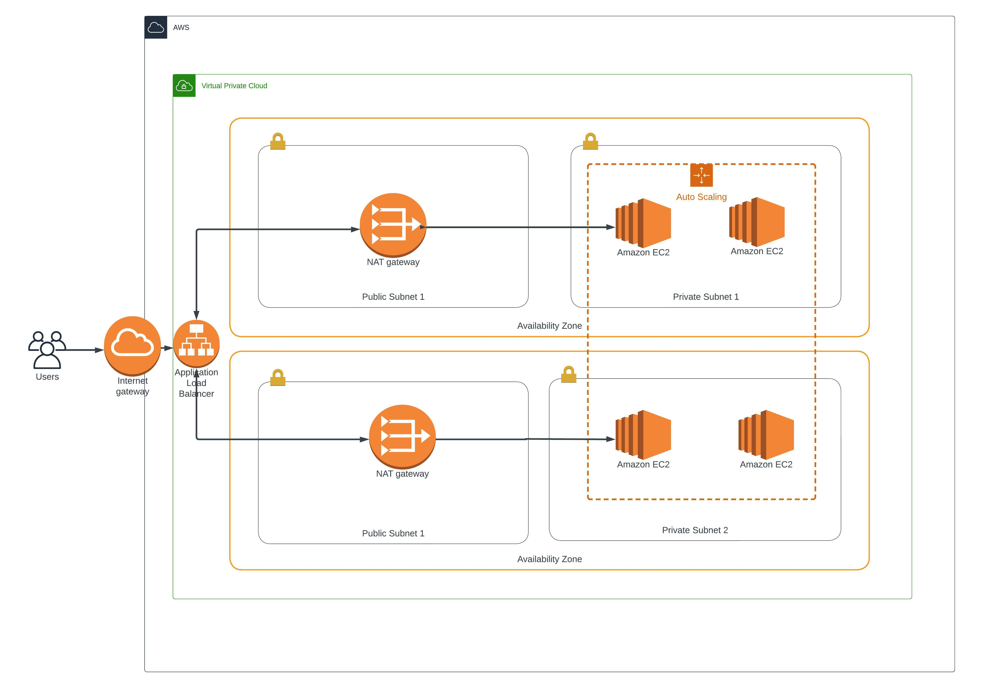

# Infrastructure as Code using CloudFormation
This folder provides a ClooudFormation template to deploy a web server in two availability zones and expose it using a Internet Gateway. The Load Balancer is used to distribute incoming traffic to the servers.  

## Dependencies
### 1. AWS account
You would require to have an AWS account to be able to build cloud infrastructure.

## Architecture

Below is the project architecture



## How to run the scripts.
```bash
# Ensure that the AWS CLI is configured before runniing the command below
# Create the network infrastructure and servers
# Check the region in the create.sh file
./create.sh infraStack template.yml server-parameters.json
# Update Stack
# Change any parameter
./update.sh infraStack template.yml server-parameters.json
```
